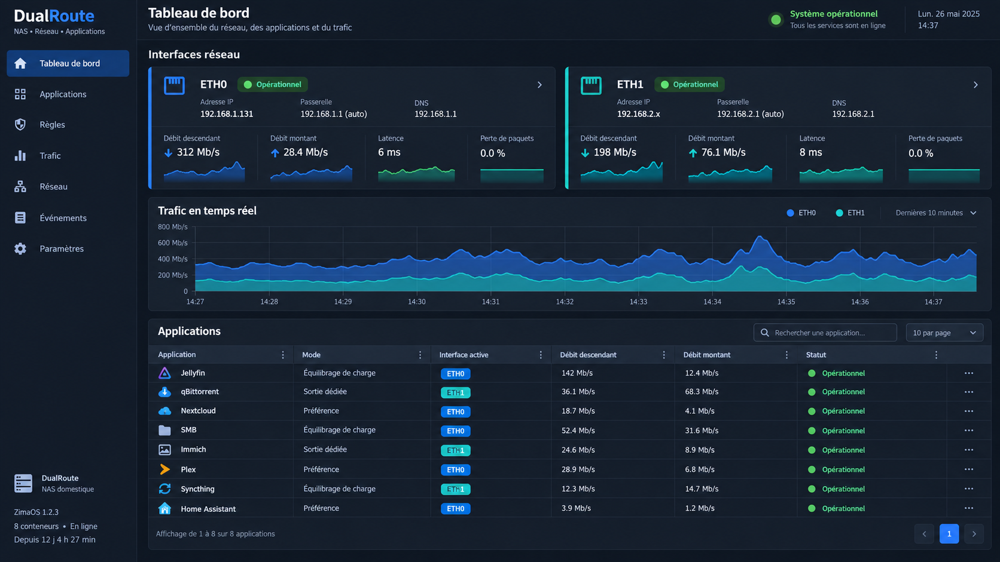

# DualRoute

DualRoute est une interface web auto-hébergée pour administrer deux sorties Ethernet sur un NAS ZimaOS. Elle découvre uniquement `eth0`, `eth1` et `tailscale0`, ainsi que les applications Docker, associe des règles de routage aux conteneurs et à SMB, puis affiche le trafic reçu et envoyé par interface.



## Fonctions disponibles

- découverte automatique de toutes les interfaces, avec une séparation explicite entre les interfaces gérées (`eth0`, `eth1`, Tailscale) et celles affichées en observation seule ;
- règles par application : interface forcée, préférence avec bascule, équilibrage par connexion et marquage QoS DSCP ;
- conservation SQLite des règles, événements et mesures ;
- surveillance temps réel et historique d'`eth0` et `eth1` ;
- affichage des débits au choix en `Mb/s` ou `Mo/s`, et option pour limiter le tableau de bord aux interfaces gérées ;
- tri par clic sur les en-têtes, filtres par colonne et redimensionnement des colonnes de tous les tableaux ;
- connexions IPv4 suivies par `conntrack`, avec attribution aux IP Docker, aux ports publiés et au service SMB local ;
- synthèse du trafic par application et détail des IP/ports, protocoles, états et interfaces identifiées ;
- routage symétrique des connexions entrantes grâce aux marques de connexion ;
- prise en charge de SMB comme service système ;
- prévisualisation complète des commandes avant activation ;
- surveillance des passerelles et bascule automatique toutes les quinze secondes en mode actif.

Les limites de débit configurées sont affichées dans les règles et conservées, mais ne créent pas encore de classes `tc` locales. Les priorités QoS vont de `1` (minimale) à `5` (maximale) et sont appliquées par marquage DSCP. Le routeur ou le fournisseur d'accès doit respecter ces marques pour qu'elles influencent la file WAN.

## Topologie recommandée

Utiliser deux sous-réseaux distincts évite les ambiguïtés ARP et permet au routage par politiques de sélectionner une passerelle sans toucher à la route principale de ZimaOS.

| Liaison | Adresse du NAS | Passerelle/routeur | Sous-réseau |
|---|---:|---:|---:|
| `eth0` | `192.168.1.131/24` | `192.168.1.1` | `192.168.1.0/24` |
| `eth1` | `192.168.2.131/24` | `192.168.2.1` | `192.168.2.0/24` |

Le second routeur doit réellement être configuré avec l'adresse LAN `192.168.2.1`. Attribuer seulement une adresse `192.168.2.x` au NAS ne suffit pas. Pour le trafic entrant, configurez également les redirections de ports sur le routeur correspondant.

Ce tableau est un exemple, pas une configuration obligatoire. Les noms ETH0/ETH1 et la carte portant la route principale sont découverts sur le NAS ; ils peuvent être inversés. Une carte avec une adresse mais sans passerelle est une configuration **réseau local uniquement** valide, notamment pour SMB sur son sous-réseau. DualRoute l’observe sans demander d’inventer une passerelle ni de modifier son adresse. Le double routage Internet reste indisponible sans une passerelle réelle sur chacune des deux cartes.

Dans Réseau, la carte sans route par défaut est sélectionnée en premier ; les deux cartes peuvent être sélectionnées et la carte principale reste protégée côté API. Le champ passerelle est facultatif. Lors d’une configuration explicitement appliquée à la carte secondaire, DualRoute retire uniquement son éventuelle route par défaut de la table principale. La passerelle renseignée est enregistrée pour les tables dédiées 101/102, installées à l’application des règles. La route par défaut de l’autre carte est conservée. Les DNS sont seulement enregistrés, sans modification du résolveur ZimaOS.

## Installation sur ZimaOS

Créer un dossier contenant le fichier [`compose.yml`](compose.yml), puis lancer depuis ce dossier :

```bash
docker compose pull
docker compose up -d
```

Ouvrir ensuite `http://ADRESSE_DU_NAS:9080`.

Depuis la version 0.4, le Compose active automatiquement les compteurs lors de la consultation du trafic, sur l’hôte et dans les espaces réseau Gluetun. L’option `DUALROUTE_ENABLE_ACCOUNTING=0` désactive cette activation. Aucune connexion n’est interrompue ou vidée. Pour une activation manuelle sur l’hôte :

```bash
sudo sysctl -w net.netfilter.nf_conntrack_acct=1
```

Les compteurs sont ajoutés aux nouvelles connexions. Les connexions déjà ouvertes peuvent rester sans compteurs jusqu’à leur renouvellement. La page Trafic distingue « Mesure… » pour la première mesure et « Sans compteur » pour ces anciennes connexions. Les débits sont calculés sur le serveur entre deux collectes, toutes les cinq secondes quand la page Trafic est consultée. L’activation du réglage hôte seul ne fournit pas les compteurs des espaces réseau VPN.

Dans Trafic, les volumes par application correspondent aux connexions encore présentes dans la table de suivi ; les connexions terminées entre deux mesures peuvent échapper au relevé. Les marques DualRoute identifient l’interface de routage ; pour les flux sans marque, un sous-réseau connecté non ambigu donne une indication signalée comme estimée. Une interface non déterminable reste « Non identifiée ». DualRoute croise les sockets Linux, les PID et les groupes Docker pour identifier les processus du NAS, les conteneurs en mode hôte et les applications partageant un Gluetun. Si cette lecture est refusée ou si le processus a déjà disparu, les adresses Docker et ports publiés servent de repli ; une attribution impossible reste explicitement non résolue. Les connexions de boucle locale sont masquées par défaut, avec un bouton indiquant leur nombre. Les totaux des interfaces ne sont pas une somme exacte des flux attribués et peuvent compter le même transfert sur plusieurs interfaces.

La découverte des interfaces, des applications, des VPN, des statistiques Docker et des connexions est indépendante, hors des requêtes HTTP. Une source lente ne bloque plus le tableau de bord. Les interfaces sont actualisées toutes les quinze secondes, Docker toutes les vingt secondes et ses statistiques cumulées toutes les trente secondes. Les mesures réseau en direct restent en mémoire (cinq secondes par défaut). L’historique n’enregistre que les interfaces gérées et les VPN : une moyenne toutes les soixante secondes par interface, avec regroupement des anciennes mesures à la lecture. Les bridges et veth ne sont pas enregistrés dans l’historique. La première moyenne apparaît après une minute. Ces deux intervalles se règlent séparément dans Paramètres.

## Surveillance Gluetun

Le profil AppArmor Docker est conservé. Sur les systèmes où il interdit la lecture des descripteurs de certains processus du NAS, leurs flux peuvent rester non résolus ; l’interface indique le nombre de lectures refusées. Les conteneurs utilisant ce même profil, y compris en mode réseau hôte, restent attribuables. Les services reconnus par ports (par exemple SMB) utilisent aussi cette identification de repli. Une attribution exhaustive des services système nécessite une politique de lecture adaptée par l’administrateur ; DualRoute ne désactive pas AppArmor.

Les conteneurs utilisant une image nommée `gluetun` sont détectés automatiquement, y compris s’ils sont arrêtés. Sans Gluetun détecté, les sections VPN sont masquées. Un conteneur détecté mais non observable reste affiché « Indéterminé ».

Si les cartes VPN n’apparaissent pas après une mise à jour alors que `/api/snapshot` contient les VPN, rechargez l’onglet avec **Ctrl+F5**. Depuis la 0.4.1, les fichiers JavaScript/CSS sont versionnés et les réponses de l’interface ne sont plus mises en cache. Un refus de l’API Gluetun ne masque pas le VPN : son état Docker et les mesures locales restent affichés, seule la lecture du statut interne et de l’IP publique nécessite les droits API.

- **Tableau de bord** : bloc violet séparé, état Docker, santé, état du tunnel, débits reçus/envoyés, IP publique et applications liées.
- **Trafic** : onglets « Interfaces du NAS » et « VPN des conteneurs », choix du VPN, connexions dans son espace réseau, processus/applications, historique du tunnel. Les connexions LAN et de supervision présentes dans cet espace réseau sont incluses ; les débits des cartes `tun*`/`wg*` mesurent le tunnel lui-même.
- **Réseau** : groupe VPN en observation seule ; les interfaces administrables restent ETH0, ETH1 et Tailscale.
- **Paramètres** : clé API facultative pour lire le statut interne et l’IP publique.

L’état « Connecté » nécessite un conteneur actif, une interface de tunnel observable et un healthcheck Docker sain. Un simple statut Docker `running` ou API `running` ne suffit pas. Le débit VPN n’est jamais ajouté aux compteurs des interfaces physiques. Aucun redémarrage ou changement de configuration Gluetun n’est exécuté.

L’API Gluetun demande généralement une authentification. Configurez un rôle dédié en lecture seule dans `/gluetun/auth/config.toml` :

```toml
[[roles]]
name = "dualroute"
routes = ["GET /v1/vpn/status", "GET /v1/publicip/ip"]
auth = "apikey"
apikey = "VOTRE_CLE"
```

Saisissez la même clé dans Paramètres. Elle est stockée dans le volume local et n’est jamais renvoyée par les API de configuration. Une authentification déjà définie dans `HTTP_CONTROL_SERVER_AUTH_DEFAULT_ROLE` est utilisée automatiquement ; la clé saisie dans DualRoute prend la priorité. L’accès utilise directement l’adresse Docker du VPN et le port de contrôle détecté (8000 par défaut) ; publier ce port sur Internet est inutile. Le pare-feu Gluetun doit autoriser l’accès local à ce port. Sans accès à cette API, la santé Docker et les compteurs du tunnel restent disponibles ; l’IP publique apparaît « Non disponible ». Voir la [documentation officielle du serveur de contrôle Gluetun](https://github.com/qdm12/gluetun-wiki/blob/main/setup/advanced/control-server.md) et du [healthcheck](https://github.com/qdm12/gluetun-wiki/blob/main/faq/healthcheck.md).

Pour passer d’une ancienne version à la 0.4, remplacez le Compose puis recréez le conteneur : les nouveaux montages et capacités ne sont pas ajoutés par un simple redémarrage. Gardez le même volume `dualroute-data` pour conserver les règles et paramètres.

```bash
docker compose pull
docker compose up -d --force-recreate
```

Le rafraîchissement conserve le tri, les filtres, la largeur des colonnes et la position dans les tableaux. Les pages Paramètres et Réseau restent stables pendant la saisie. Un bouton permet de suspendre l’actualisation de Trafic.

L'image publiée est `ghcr.io/mkdevtests/dualroute:latest`. Une image est également publiée avec le numéro de chaque tag Git, par exemple `ghcr.io/mkdevtests/dualroute:v0.1.0`.

Le fichier Compose utilise :

- `network_mode: host`, nécessaire pour voir et administrer les interfaces du NAS ;
- les capacités `NET_ADMIN` et `NET_RAW` pour `ip`, `nftables` et les tests de passerelle ;
- `SYS_PTRACE` et `/proc:/host/proc:ro` pour relier les sockets aux processus hôtes et conteneurs ;
- `SYS_ADMIN` pour rejoindre uniquement les espaces réseau VPN avec `nsenter` et lire leurs compteurs/connexions. Cette capacité est large : le conteneur doit être considéré comme un outil d’administration du NAS ;
- `/proc/sys/net:/host/sys/net:rw` pour activer `nf_conntrack_acct` dans chaque espace réseau malgré le montage `/proc/sys` protégé par Docker. L’application écrit uniquement ce réglage ;
- `/var/run/docker.sock` en lecture seule pour découvrir les applications ;
- un volume `dualroute-data` pour la base SQLite.

Au premier démarrage, DualRoute reste en mode prévisualisation. Configurez et testez `eth1`, créez les règles, ouvrez **Paramètres**, examinez le plan technique, puis activez le mode actif. L'application demande encore la saisie de `APPLIQUER` avant la première modification des règles Linux.

Par défaut, l'API refuse de reconfigurer l'interface qui porte la route principale du NAS. Cette protection évite de couper la session d'administration. Elle peut être levée volontairement avec `DUALROUTE_ALLOW_PRIMARY_RECONFIGURE=1`, mais ce réglage ne doit pas être utilisé pendant l'installation initiale.

## Modèle de routage

DualRoute crée uniquement une table `nftables` nommée `inet dualroute` et les tables de routage Linux `101` et `102`. Les nouvelles connexions d'un conteneur sont marquées selon sa règle. La marque est conservée dans `conntrack`, ce qui maintient les réponses entrantes sur l'interface d'origine. L'équilibrage sélectionne une sortie par connexion afin qu'une même session TCP ne change pas de lien.

Les destinations privées RFC1918 ne sont pas forcées par les règles des conteneurs. Elles continuent d'utiliser la table principale du NAS. Cette protection empêche une règle Internet d'envoyer le trafic LAN vers une mauvaise passerelle.

## Développement et vérification

```bash
docker build -t dualroute:local .
docker run --rm -v "$PWD:/work" -w /work dualroute:local python -m unittest discover -s tests -v
```

Le Compose de développement construit l'image depuis les sources :

```bash
docker compose -f compose.dev.yml up -d --build
```

Pour lancer l'interface sans modifier le réseau, conservez le mode actif désactivé. Sur Windows ou macOS, la découverte reflète la machine virtuelle Docker ; la validation réelle doit se faire sur le NAS Linux.

## Limites de la première version

- IPv4 uniquement pour l'application des politiques ;
- les limites de débit sont enregistrées mais pas encore façonnées localement avec `tc` ;
- un conteneur utilisant directement `network_mode: host` ne possède pas d'adresse Docker distincte. Sa règle doit alors être exprimée par ports, comme SMB ;
- les modifications d'adresse effectuées avec `ip address replace` peuvent être réécrites par ZimaOS après redémarrage. DualRoute conserve la configuration, mais la persistance native de ZimaOS devra être validée sur le modèle de NAS cible.

## Maquettes validées

- [Tableau de bord](docs/mockups/01-dashboard.png)
- [Règles](docs/mockups/02-regles.png)
- [Configuration réseau](docs/mockups/03-reseau-v2.png)
- [Analyse du trafic](docs/mockups/04-trafic.png)
